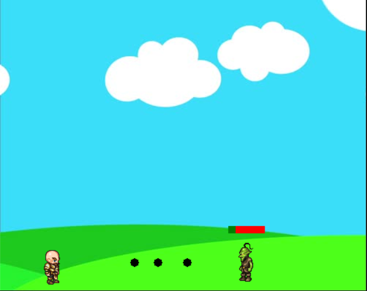

# Projectile-Game-Python

This game is built using a python wrapper module called 
[pygame](https://pypi.org/project/pygame/) for the SDL multimedia library. 

>Use Arrow keys for Navigation and \<SPACE KEY> to shoot
 ---
